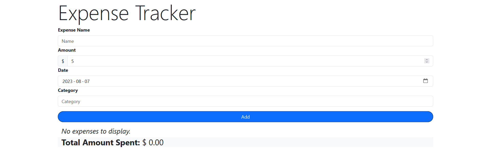
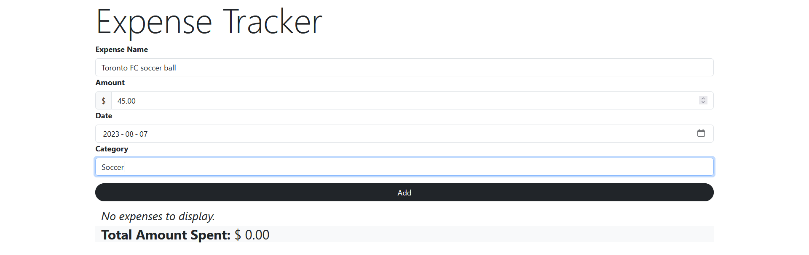
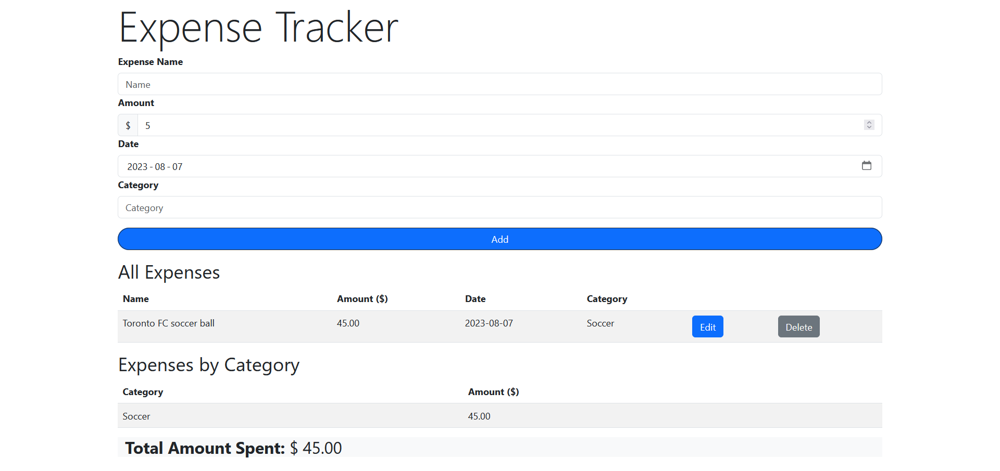
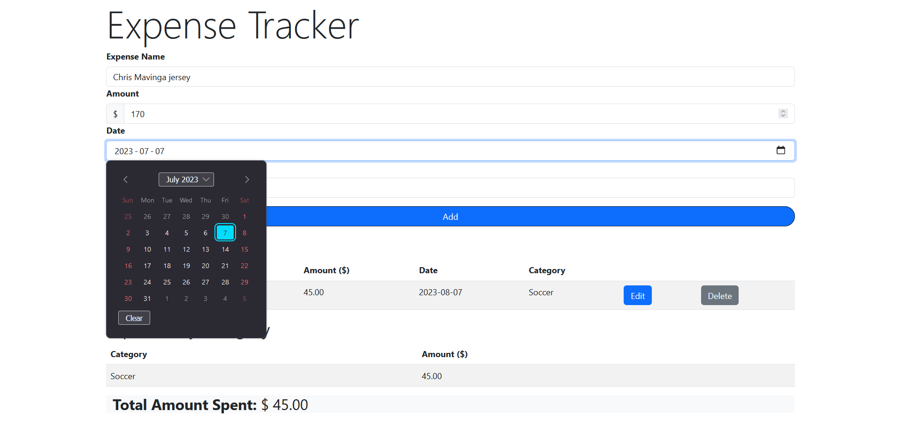
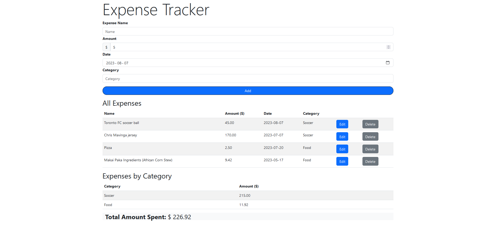
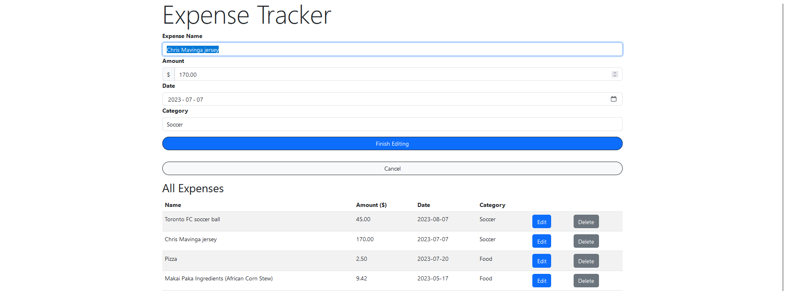
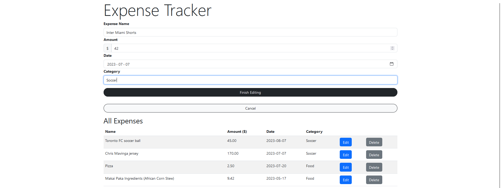
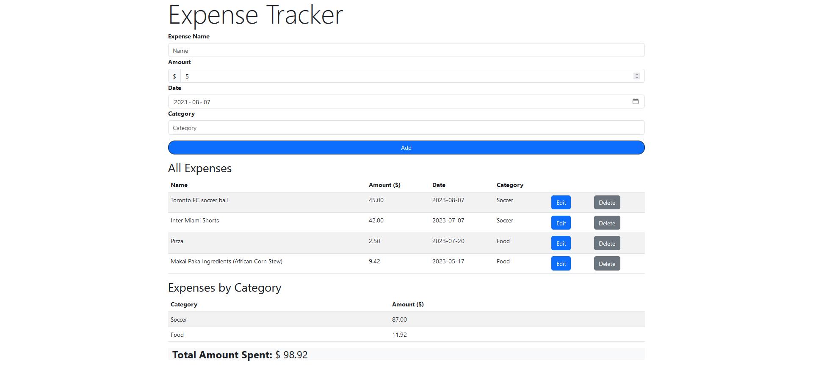
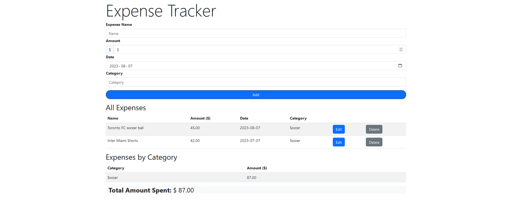

# FinTrack

This is a full-stack expense tracker application created using primarily React and Django. It supports expense editing, expense storage in a SQLite database, and aggregation of expenses by categories using a map data structure implementation.

## Technologies Used

- React
- JavaScript
- Python
- Django
- Bootstrap 5
- [Create React App](https://github.com/facebook/create-react-app)

## Images

### Page Without Expenses Added

### Adding First Expense

### Adding Multiple Expenses

Note how expenses are also listed by category in the second image.

### Editing Expense

*Changing "Chris Mavinga Jersey" to "Inter Miami Shorts".*

### Deleting Expense

"Total Amount Spent" reduces in correspondence with the deleted expenses.

## Dependencies

- Python
- NodeJS
- pip
- pipenv

For more details on how to set-up the Python virtual environment, see [this website](https://www.digitalocean.com/community/tutorials/build-a-to-do-application-using-django-and-react#step-1-setting-up-the-backend). I referenced it to create the Django back-end.

## How to Run

First start up the back-end, then start up the front-end and run the two parts of the application *simulataneously*.

### Back-end Set-up

1. From the root directory, move into the `backend` folder.

> `cd backend`

2. Activate the back-end environment.

> `pipenv shell`

3. Run the Django back-end.

> `python manage.py runserver`

### Front-end Set-up

1. From the root directory, move into `frontend` folder.

> `cd frontend`

2. Run the React front-end.

> `npm start`
